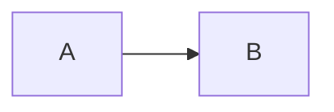

# mermaid test

A minimal:

```mermaid
graph LR
    A --> B
```

B minimal with shape label:

```mermaid
graph LR
    A[ico CLI] --> B[Router]
```

C chinese labels:

```mermaid
graph LR
    CLI[ico CLI] --> Router[路由层]
    Router --> CUDA[CUDA 后端]
```

D quoted chinese:

```mermaid
graph LR
    CLI["ico CLI"] --> Router["路由层"]
    Router --> CUDA["CUDA 后端"]
```

E flowchart:

```mermaid
flowchart LR
    CLI["ico CLI"] --> Router["路由层"]
    Router --> CUDA["CUDA 后端"]
```
