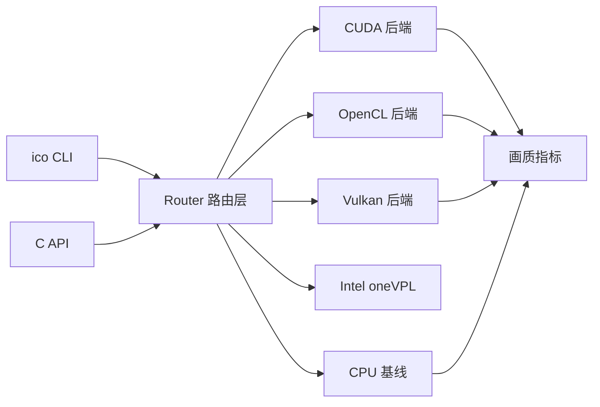
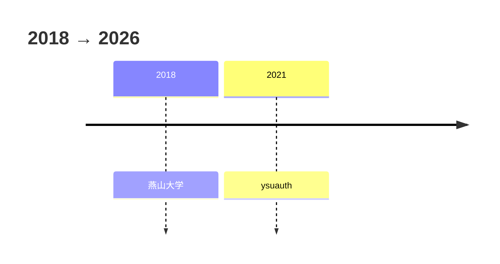

# mermaid isolation

## A: flow alone

```mermaid
graph LR
    CLI[ico CLI] --> Router[Router 路由层]
    API[C API] --> Router
    Router --> CUDA[CUDA 后端]
    Router --> OCL[OpenCL 后端]
    Router --> VK[Vulkan 后端]
    Router --> VPL[Intel oneVPL]
    Router --> CPU[CPU 基线]
    CUDA --> Metric[画质指标]
    OCL --> Metric
    VK --> Metric
    CPU --> Metric
```

## B: timeline then flow

```mermaid
timeline
    title 2018 → 2026
    2018 : 燕山大学
    2021 : ysuauth
```

```mermaid
graph LR
    CLI[ico CLI] --> Router[Router 路由层]
    API[C API] --> Router
    Router --> CUDA[CUDA 后端]
    Router --> OCL[OpenCL 后端]
    Router --> VK[Vulkan 后端]
    Router --> VPL[Intel oneVPL]
    Router --> CPU[CPU 基线]
    CUDA --> Metric[画质指标]
    OCL --> Metric
    VK --> Metric
    CPU --> Metric
```
