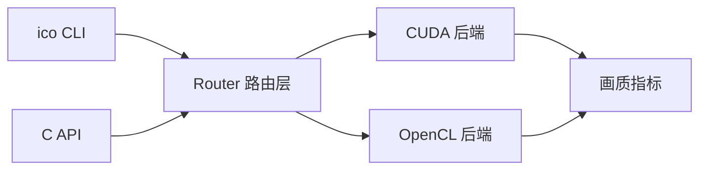
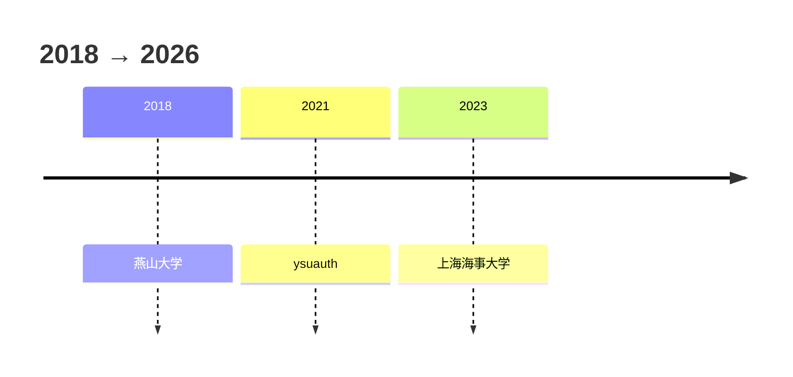
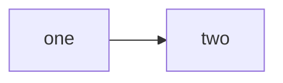
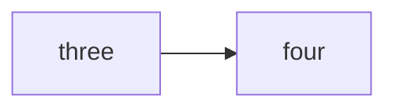

# mermaid isolation

## C: flow then timeline

```mermaid
graph LR
    CLI[ico CLI] --> Router[Router 路由层]
    API[C API] --> Router
    Router --> CUDA[CUDA 后端]
    Router --> OCL[OpenCL 后端]
    CUDA --> Metric[画质指标]
    OCL --> Metric
```

```mermaid
timeline
    title 2018 → 2026
    2018 : 燕山大学
    2021 : ysuauth
    2023 : 上海海事大学
```

## D: two graphs back to back

```mermaid
graph LR
    A[one] --> B[two]
```

```mermaid
graph LR
    C[three] --> D[four]
```
